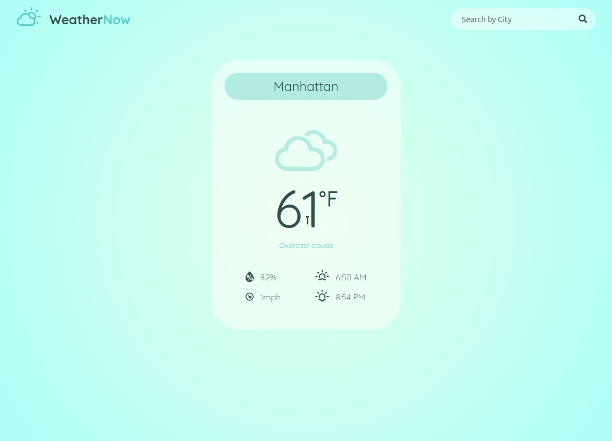

# Weather API
A vanilla Javascript based Weather API project created for [the Odin Project Ruby on Rails Course](https://www.theodinproject.com/paths/full-stack-ruby-on-rails/courses/javascript/lessons/weather-app) to implement asynchronous functions and API integration with javascript.

## Features
The user can search for a city name which retrieves the information for the specified city from the [OpenWeather API](https://openweathermap.org/api). If the city doesn't exist then a pop up will indicate that the city is not found. 

The user can view the current temperature, the cloud coverage, the humidity index, wind direction and speed, along with sunrise and sunset times in local time for that city. Units can be changed by clicking on the degree (fahrenheit or celsius) which converts all information into imperial or metric. 

## Demo
Check out the live version [here](https://zxum.github.io/weather-app-js/)

## Image Credits 
Icons are created by [erikflowers](https://erikflowers.github.io/weather-icons/)

## Reflections
To think I had no idea what API even meant a year ago amazes me. I read through the OpenWeather API and had a good sense of how I can use it. Setting up the asynchronous function and getting the API data was so easy! I added a few visual details like the beautiful weather icons by Erik Flowers, and made my finishing touches on showing imperial or metric units of measurement.

Just when I thought everything was working great, I noticed the times were completely out of whack! They were showing night times for sunrise! I did some digging and found out that date in Javascript is saved as local timezone, but the API provides the time in UTC. To fix this, I extracted the time and timezones, add them together, then multiply by 1000 (since the times are in seconds), then use getTimezoneOffset(). With the timestamp generated, I create a Date object, and format it in localeTimeString so it looks pretty!

I also noticed later on that I could type in mumbo-jumbo cities and it would still change the content of the city name, so I made sure to include a check on what kind of response I was getting from the API. If it wasn't a 200 status code or an OK, then it would pop up an alert that said the city isn't found. 

Can't wait to use more APIs and make some of my own! 